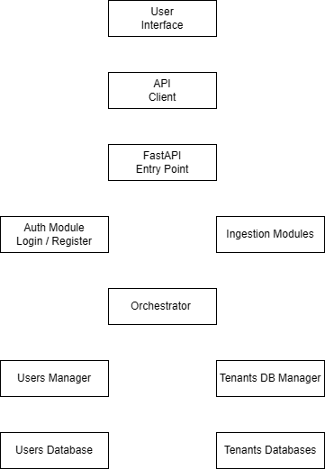

# Project Name: BluePrint

## Version
0.1 MVP Draft

---

# 1. System Purpose

The Blueprint Project is a multi-tenant web application designed for small businesses that manage their data across disconnected platforms such as Excel sheets, Shopify exports, CSV files, and future third-party integrations.

The system centralizes business data into a structured database and provides a unified platform for data ingestion, storage, management, and future analytics and predictions.

---

# 2. Inputs & Outputs

## 2.1 Inputs

- **Current Inputs:**
    - Excel Files
    - CSV Files
- **Future Inputs:**
    - Shopify API
    - REST APIs

## 2.2 Outputs

- **Current Outputs:**
    - Structured database records
    - Upload status

- **Future Outputs:**
    - Dashboards
    - KPIs
    - Forecasts
    - Reports
    - AI-generated insights

---

# 3. System Operation

1. User logs into the system
2. User belongs to an Entity
3. User uploads Excel/CSV file
4. Backend validates the file
5. Parser Extract the data
6. Data transformation layer normalizes structure
7. Clean data stored in entity database schema
8. User can query or retrieve data later

---

# 4. Functional Requirements

- Authentication & Authorization
- Entity Management
- File Upload System
- Data Processing
- Data Storage
- API Layer

---

# 5. Non-Functional Requirements

- Scalability
- Security
- Reliability
- Performance
- Maintainability
- Extensibility

---

# 6. System Architecture

**High-Level Architecture**

---

# 7. Components Description

## 7.1 User Interface

## 7.2 API Client

## 7.3 FastAPI Server

## 7.4 Auth Module

## 7.5 Orchestrator

## 7.6 Users Manager

## 8.7 Tenants DB Manager

## 8.8 Users Database

## 8.9 Tenants Databases

---
